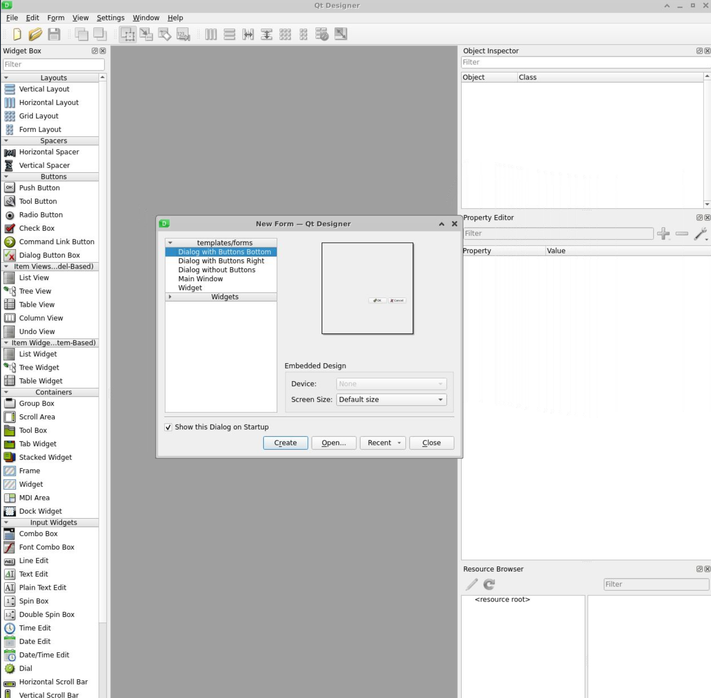

## 5. Qt Designer

Some Reading materials:
- [tutorial for beginners](https://realpython.com/qt-designer-python/#building-main-windows-with-qt-designer-and-python)

There are 3 ways to install qt designer
- use pip
- use linux system package manager
- use qt official standalone installer

### 5.1 Install via pip

When using pip, we recommend you to create a virtual environment. Then install the qt designer in the virtual 
environment.

```shell
# create virtual env
python3 -m venv ./venv
# activate venv
source venv/bin/activate

# install qt designer 
pip install pyqt6 pyqt6-tools

# run the qt designer
qt6-tools designer
```

If everything works well, you should see below Gui.




## 5.2 QT designer basics

In the above figure you can see the `qt designer’s main window(background)` and the `New Form dialog`(foreground). 
In the `New Form` dialog, you can select from `five available GUI templates`:

| Template                   | 	Form Type  | 	Widgets                                                                | 	Base Class |
|----------------------------|-------------|-------------------------------------------------------------------------|-------------|
| Dialog with Buttons Bottom | 	Dialog     | 	OK and Cancel buttons laid out horizontally on the bottom-right corner | 	QDialog    |
| Dialog with Buttons Right	 | Dialog	     | OK and Cancel buttons laid out vertically on the top-right corner	      | QDialog     |
| Dialog without Buttons	    | Dialog	     | No	                                                                     | QDialog     |
| Main Window	               | Main Window | 	A menu bar at the top and a status bar at the bottom	                  | QMainWindow |
| Widget	                    | Widget	     | No	                                                                     | QWidget     |

You can click on `File->New` to show the qt designer.

> Note that the first two dialog templates have their own `default buttons`. These are standard buttons included in 
  a `QDialogButtonBox`. This class automatically handles the position or order of buttons across different platforms.
 

### 5.2.1 QT designer main Window

Qt Designer’s main window provides a menu bar with options for 
- saving and managing forms, 
- editing forms and changing the edit mode, 
- laying out and previewing forms, 
- tuning the application’s settings
- accessing its help documentation

#### Left hand side
On the left hand side, you can find the widget box, you can find all available objects that you can use to create a GUI:
- layout managers
- spacers
- standard widgets
- ETC.

#### Right hand side
On the right hand side, you can find the 
- **Object Inspector**: provides a tree view of all the objects on the current form. The Object Inspector also has a 
                        filter box at the top to allow you to find objects in the tree. You can use the Object 
                         Inspector to set the name and other properties of the form and its widgets. You can also 
                         `right-click` any widget to access a context menu with additional options
- **Property Editor**:  holds a two-column table with the active `object’s properties` and their `values`. You can use 
                        the Property Editor to edit the value of an object’s properties, as the name implies.
- **Resource Browser**: provides a quick way of adding resources, such as icons, translation files, images, and other binary files to your applications.
- **Action Editor**: provides a way to create actions and add them to your forms.
- **Signal/Slot Editor**: provides a way to connect signals and slots in your forms.

### 5.2.2 Workflow

You can design your GUI just with drag and drop. Once you finished the editing, you can save it in a file. `Qt Designer
saves its forms in .ui files`, which are `XML files` that contain all the information you’ll need to later recreate 
the GUI in your applications.

To save a form, you can click on `File -> Save`, enter `<form-name>.ui` , select a directory to save the file in, 
and click `Save` button. Or just pressing `Ctrl+S` on your keyboard.

### 5.2.3 Convert .ui to python ui

As we mentioned above, the qt designer outputs a file in .ui. To use it in python, we need to convert it to python.

```shell
pyuic6 -o mainWindowUI.py main_window_ui
```

The generated main_window_ui.py are in below:
```python
# Form implementation generated from reading ui file 'main_window.ui'
#
# Created by: PyQt6 UI code generator 6.1.0
#
# WARNING: Any manual changes made to this file will be lost when pyuic6 is
# run again.  Do not edit this file unless you know what you are doing.
import sys

from PyQt6 import QtCore, QtGui, QtWidgets


class Ui_MainWindow(object):
    def setupUi(self, MainWindow):
        MainWindow.setObjectName("MainWindow")
        MainWindow.resize(1413, 898)
        self.centralwidget = QtWidgets.QWidget(MainWindow)
        self.centralwidget.setObjectName("centralwidget")
        self.pushButton = QtWidgets.QPushButton(self.centralwidget)
        self.pushButton.setGeometry(QtCore.QRect(810, 780, 201, 51))
        self.pushButton.setObjectName("pushButton")
        self.comboBox = QtWidgets.QComboBox(self.centralwidget)
        self.comboBox.setGeometry(QtCore.QRect(340, 780, 221, 51))
        self.comboBox.setObjectName("comboBox")
        self.splitter = QtWidgets.QSplitter(self.centralwidget)
        self.splitter.setGeometry(QtCore.QRect(-25, 3, 1441, 741))
        self.splitter.setOrientation(QtCore.Qt.Orientation.Horizontal)
        self.splitter.setObjectName("splitter")
        self.horizontalLayoutWidget = QtWidgets.QWidget(self.splitter)
        self.horizontalLayoutWidget.setObjectName("horizontalLayoutWidget")
        self.horizontalLayout = QtWidgets.QHBoxLayout(self.horizontalLayoutWidget)
        self.horizontalLayout.setContentsMargins(0, 0, 0, 0)
        self.horizontalLayout.setObjectName("horizontalLayout")
        self.treeView = QtWidgets.QTreeView(self.horizontalLayoutWidget)
        self.treeView.setObjectName("treeView")
        self.horizontalLayout.addWidget(self.treeView)
        self.horizontalLayoutWidget_2 = QtWidgets.QWidget(self.splitter)
        self.horizontalLayoutWidget_2.setObjectName("horizontalLayoutWidget_2")
        self.horizontalLayout_2 = QtWidgets.QHBoxLayout(self.horizontalLayoutWidget_2)
        self.horizontalLayout_2.setContentsMargins(0, 0, 0, 0)
        self.horizontalLayout_2.setObjectName("horizontalLayout_2")
        self.tableView = QtWidgets.QTableView(self.horizontalLayoutWidget_2)
        self.tableView.setObjectName("tableView")
        self.horizontalLayout_2.addWidget(self.tableView)
        MainWindow.setCentralWidget(self.centralwidget)
        self.menubar = QtWidgets.QMenuBar(MainWindow)
        self.menubar.setGeometry(QtCore.QRect(0, 0, 1413, 19))
        self.menubar.setObjectName("menubar")
        self.menu_File = QtWidgets.QMenu(self.menubar)
        self.menu_File.setObjectName("menu_File")
        self.menu_Settings = QtWidgets.QMenu(self.menubar)
        self.menu_Settings.setObjectName("menu_Settings")
        self.menu_Help = QtWidgets.QMenu(self.menubar)
        self.menu_Help.setObjectName("menu_Help")
        MainWindow.setMenuBar(self.menubar)
        self.action_New = QtGui.QAction(MainWindow)
        self.action_New.setObjectName("action_New")
        self.action_Open = QtGui.QAction(MainWindow)
        self.action_Open.setObjectName("action_Open")
        self.actionOpen_Recent = QtGui.QAction(MainWindow)
        self.actionOpen_Recent.setObjectName("actionOpen_Recent")
        self.action_Save = QtGui.QAction(MainWindow)
        self.action_Save.setObjectName("action_Save")
        self.action_Exit = QtGui.QAction(MainWindow)
        self.action_Exit.setObjectName("action_Exit")
        self.menu_File.addAction(self.action_New)
        self.menu_File.addAction(self.action_Open)
        self.menu_File.addAction(self.actionOpen_Recent)
        self.menu_File.addAction(self.action_Save)
        self.menu_File.addAction(self.action_Exit)
        self.menubar.addAction(self.menu_File.menuAction())
        self.menubar.addAction(self.menu_Settings.menuAction())
        self.menubar.addAction(self.menu_Help.menuAction())

        self.retranslateUi(MainWindow)
        QtCore.QMetaObject.connectSlotsByName(MainWindow)

    def retranslateUi(self, MainWindow):
        _translate = QtCore.QCoreApplication.translate
        MainWindow.setWindowTitle(_translate("MainWindow", "Pengfei data manager"))
        self.pushButton.setText(_translate("MainWindow", "PushButton"))
        self.menu_File.setTitle(_translate("MainWindow", "&File"))
        self.menu_Settings.setTitle(_translate("MainWindow", "&Settings"))
        self.menu_Help.setTitle(_translate("MainWindow", "&Help"))
        self.action_New.setText(_translate("MainWindow", "&New"))
        self.action_Open.setText(_translate("MainWindow", "&Open"))
        self.actionOpen_Recent.setText(_translate("MainWindow", "Open &Recent"))
        self.action_Save.setText(_translate("MainWindow", "&Save"))
        self.action_Exit.setText(_translate("MainWindow", "&Exit"))
```

You can notice the file contains one class `Ui_MainWindow`, which has all the code for generating the GUI of the sample 
editor’s main window.

The method `.retranslateUi()` contains code for `internationalization and localization`, but this topic is beyond the 
scope of this tutorial.


## 5.2.4 Integrate the generated view


## 5.3 A simple example

Create a main window, then edit the `menu bar` by clicking on the "Type Here". You can preview your form by clicking 
`Form->Preview`, or hit the key combination `Ctrl+R` on your keyboard.

### Menu bar shortcut
You can use an `ampersand symbol (&)` before a given letter to provide a `keyboard shortcut`. For example, if you 
add &File in the File menu, then you can access this menu by pressing `Alt+F`.

### Button separator

You can add `separators` to your menus. This is a good way to visually separate menu options and group them logically. 
To add a separator, `double-click the Add Separator option` at the end of the active menu in the Menu Editor.

You can `remove an existing separator by right-clicking it` and then `selecting Remove Separator` in the context menu. 
This menu also allows you to add new separators.

### submenu 
To add a `submenu` to a given menu option, `click the icon on the right side of the menu` option to which you want to 
attach the submenu. 


### Action

When you add a menu option to a given menu, you create an `action`. Qt Designer provides an `Action Editor` for 
creating, customizing, and managing actions. The tool provides a few handy options that you can use to fine-tune your actions:
- The text of the action, which will be shown on menu options and toolbar buttons
- The object name, which you’ll use in your code to reference the action object
- The icons that will be shown on your menu options and toolbar buttons
- The checkable property of the action
- The keyboard shortcuts, which will provide the user with a quick way to access the action

### Laying out a single Central Widget

**Qt Designer uses QMainWindow for building its Main Window template**. This class provides a default layout that allows 
you to create `a menu bar, one or more toolbars, one or more dock widgets, a status bar, and a central widget.`

By default, Qt Designer uses a `QWidget object as the central widget` on the Main Window template. On top of that 
widget, you can place either a `single widget or multiple widgets` in a coherent layout.

Best practice for designing layout is to cut your design into sub-layout, and each sub-layout corresponding a different 
module of your design. The easiest way is to divide them into 
- top
- middle 
- bottom 

And sub-layout can have sub-sub-layout. For example normally we divide middle into right and left. Finally, when we can't 
divide anymore sub-layout(module), we can start to add widget on the layout the last level.

To organize layout, you can use any below layout:

| Option	                          | Widget Arrangement                                | 	Layout Class | 	Keyboard Shortcut |
|----------------------------------|---------------------------------------------------|---------------|--------------------|
| Lay Out Horizontally             | 	Horizontally in one row and several columns      | 	QHBoxLayout  | 	Ctrl+1            |
| Lay Out Vertically	              | Vertically in one column and several rows	        | QVBoxLayout	  | Ctrl+2             |
| Lay Out Horizontally in Splitter | 	Horizontally in a resizable splitter	            | QSplitter	    | Ctrl+3             |
| Lay Out Vertically in Splitter	  | Vertically in a resizable splitter	               | QSplitter	    | Ctrl+4             |
| Lay Out in a Grid	               | Tabularly in a grid with several rows and columns | 	QGridLayout	 | Ctrl+5             |
| Lay Out in a Form Layout         | 	Tabularly in a two-column table	                 | QFormLayout	  | Ctrl+6             |

> The two Layouts in Splitter only works on layout not on widget. Even though you only have two widget on the main, if 
  you want to use splitter layout to organize these two widget, you need to create two Boxlayout and put them into each 
   layout and then link the two Boxlayout with splitter layout.


Two other usefull function is :

- **Break Layout**: allows you to break an existing layout. Once widgets are arranged in a layout, you can’t move or 
           resize them individually because their geometry is controlled by the layout. To modify individual widgets, 
           you might need to break the layout and redo it later. To access this option, you can press `Ctrl+0` on your keyboard.

- **Adjust Size**: adjusts the size of the layout to accommodate contained widgets and to ensure that each has enough 
              space to be visible. To access this option, you can press `Ctrl+J` on your keyboard.
