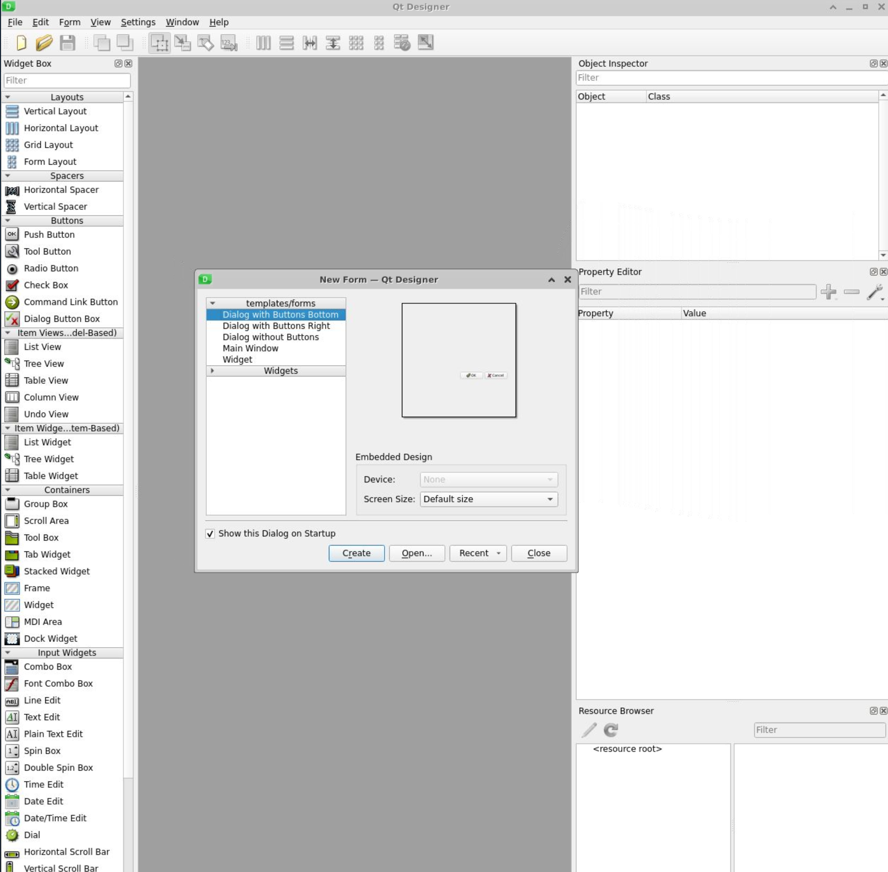

# Python_Desktop_APP_Framework

Python provides many frameworks to build desktop with GUI. The following are the most user-friendly and effective 
Python desktop app development frameworks:

- PyQT
- Tkinter
- Kivy
- WxPython
- Bottle
- PyGUI

In this repo, we will use PyQT to make some desktop applications.

## 1. Your first PyQT app

To run a PyQT app, you need to follow the below 5 steps
1. Import QApplication and all the required widgets 
2. Create an instance of QApplication
3. Create your application's GUI
4. Show your application's GUI
5. Run your application's event loop, when user click on close, the application will stop too.

You can find an example in [L01_hello_world.py](src/Lessons/L01_hello_world.py)


## 2. Code Styles of PyQT app

You can notice that `PyQt’s API doesn’t follow PEP 8 coding style` and naming conventions. PyQt is built 
around Qt, which is written in C++ and uses the **camel case** naming style for functions, methods, and variables. 

We will follow the PEP recommendation `where an existing library has a different style, internal consistency is preferred.`
So we will use camel case too in this repo.

## 3. Basics of PyQt

Below elements are the building blocks of any PyQt GUI application. Most of them are represented as `Python classes`
 that live in the `PyQt6.QtWidgets` module:
- Widgets
- Layout managers
- Dialogs
- Main windows
- Applications
- Event loops
- Signals and slots

### 3.1 Widgets

**Widgets are rectangular graphical components that you can place on your application’s windows to build the GUI**. 
Widgets have several attributes and methods that allow you to tweak their appearance and behavior. They can also paint 
a representation of themselves on the screen.

**Widgets also detect mouse clicks, keypresses, and other events from the user**, the window system, and other sources. 
Each time `a widget catches an event, it emits a signal to announce its state change`. PyQt has a rich and modern 
collection of widgets. Some of the most common and useful PyQt widgets are:
- Buttons : You can create a button by instantiating `QPushButton`, a class that provides a classic command button. 
            Typical buttons are Ok, Cancel, Apply, Yes, No, and Close.
- Labels :  you can create with `QLabel`. Labels let you display useful information as `text or images`
- Line edits (input box): It allows you to enter a single line of text. You can create line edits with the `QLineEdit` class
- Combo boxes : You can create them by instantiating `QComboBox`. A combo box will present your user with a dropdown 
                list of options in a way that takes up minimal screen space.
- Radio buttons : You can create with `QRadioButton`. A QRadioButton object is an option button that you can click to 
                switch on.

### 3.2 Layout managers

You need to arrange the widgets so that your GUI is both coherent and functional. If you use methods such as `.resize()` 
, `.resizeEvent()` and `.move()` to give widgets absolute sizes and positions. You will have below major drawbacks:
- Many manual calculations to determine the correct size and position of every widget 
- Extra calculations to respond to window resize events
- Redo most of your calculations when the window’s layout changes in any way

**To avoid all the manual calculations, we need to use Layout managers**. PyQt provides four basic layout manager 
classes:

- QHBoxLayout : arranges widgets horizontally from left to right. code example [L02_horizontal_layout.py](src/Lessons/L02_horizontal_layout.py)
- QVBoxLayout : arranges widgets vertically from top to bottom. code example [L03_vertical_layout.py](src/Lessons/L03_vertical_layout.py)
- QGridLayout : arranges widgets in a `grid of rows and columns`. Every widget will have a `relative position` on the grid. 
                You can define `a widget’s position with a pair of coordinates like (row, column)`. Each coordinate must 
                be an `integer` number. [L04_grid_layout.py](src/Lessons/L04_grid_layout.py)
- QFormLayout : arranges widgets in a **two-column layout**. The first column usually `displays messages in labels`. The
                second column generally `contains widgets like QLineEdit, QComboBox, QSpinBox`, and so on. code example
                [L05_form_layout.py](src/Lessons/L05_form_layout.py).

### 3.3 Dialogs window app

PyQt application can be divided into two categories:

**A main windowstyle application**: The application’s main window inherits from `QMainWindow`.
**A dialog-style application**: The application’s main window inherits from `QDialog`.

A **dialog window** is a stand-alone window that you can use as the main window for your application. `Dialog windows 
are commonly used in main windowstyle applications for brief communication and interaction with the user.`. A dialog
can be
- Modal: Blocks input to any other visible windows in the same application. You can display a modal dialog by calling 
         its `.exec()` method.
- Modeless: Operates independently of other windows in the same application. You can display a modeless dialog 
         by using its `.show()` method.

> A dialog is always an independent window. If a dialog has a parent, then it’ll display centered on top of the parent 
  widget. Dialogs with a parent will share the parent’s task bar entry. If you don’t set parent for a given dialog, 
  then the dialog will get its own entry in the system’s task bar.


A code example can be found in [L06_dialog.py](src/Lessons/L06_dialog.py)

### 3.4 Main window app

Most of the time, your GUI applications will be `main window style apps`. This means that they’ll have a `menu bar, 
some toolbars, a status bar, and a central widget that’ll be the GUI’s main element`. It’s also common for your apps 
to have `several dialogs to accomplish secondary actions` that depend on a user’s input.

**QMainWindow** provides a framework for building your application’s GUI quickly. This class has its own built-in layout, 
which accepts the following graphical components:

| Component                                                                                                        | 	Position on Window       | 	Description                                                                                                                                                      |
|------------------------------------------------------------------------------------------------------------------|---------------------------|-------------------------------------------------------------------------------------------------------------------------------------------------------------------|
| One [menu bar](https://www.riverbankcomputing.com/static/Docs/PyQt6/api/qtwidgets/qmenubar.html)                 | 	Top	                     | Holds the application’s main menu                                                                                                                                 |
| One or more [toolbars](https://www.riverbankcomputing.com/static/Docs/PyQt6/api/qtwidgets/qtoolbar.html)         | 	Sides	                   | Hold [tool buttons](https://www.riverbankcomputing.com/static/Docs/PyQt6/api/qtwidgets/qtoolbutton.html) and other widgets, such as QComboBox, QSpinBox, and more |
| One central widget	                                                                                              | Center	                   | Holds the window’s central widget, which can be of any type, including a composite widget                                                                         |
| One or more [dock widgets](https://www.riverbankcomputing.com/static/Docs/PyQt6/api/qtwidgets/qdockwidget.html)	 | Around the central widget | 	Are small, movable, and hidable windows                                                                                                                          |
| One [status bar](https://www.riverbankcomputing.com/static/Docs/PyQt6/api/qtwidgets/qstatusbar.html)	            | Bottom	                   | Holds the app’s status bar, which shows status information                                                                                                        |

Code example can be found in [L07_main_window.py](src/Lessons/L07_main_window.py)

### 3.5. Applications

`QApplication` is the core component of any PyQt application. It manages the `application’s control flow` and its `main settings`.

**Every PyQt GUI application must have one QApplication instance**. Some responsibilities of this class include:

- Handling the app’s `initialization and finalization`
- Providing the `event loop` and event handling
- Handling most system-wide and application-wide `settings`
- Providing access to `global information`, such as the application’s directory, screen size, and so on
- Parsing common `command-line arguments`
- Defining the application’s `look and feel`
- Providing `localization` capabilities

### 3.6 Event loops

GUI applications are `event-driven`, which means that functions and methods are called in response to user actions (e.g. clicking on a button). 
**Events are handled by an event loop, also known as a main loop, which is an infinite loop**. The event loop continues 
to work until the application is terminated.

**All GUI applications have an event loop**. When an event happens, then the loop checks if it’s a `terminate event`. 
In that case, the loop finishes, and the application exits. Otherwise, the event is sent to the `application’s event 
queue` for further processing, and the loop iterates again. In PyQt6, you can run the app’s event loop by calling 
`.exec() on the QApplication object`.


### Signals and Slots

`PyQt widgets act as event-catchers`. This means that every `widget can catch specific events`, like mouse clicks, 
keypresses, and so on. In response to these events, a `widget emits a signal`, which is a kind of message that 
announces `a change in its state`.

The `signal on its own doesn’t perform any action`. If you want a signal to trigger an action, then you need to 
**connect it to a slot**. This is the function or method that’ll perform an action whenever its associated signal 
is emitted. You can use any `Python callable as a slot`.

If a signal isn’t connected to any slot, then nothing happens and the signal is ignored. Some of the most relevant 
features of signals and slots include the following:

- A signal can be connected to one or many slots.
- A signal may also be connected to another signal.
- A slot may be connected to one or many signals.

You can use the following syntax to connect a signal and a slot:
```python
widget.signal.connect(slot_function)
```

A complete example can be found in [L08_signal_slot.py](src/Lessons/L08_signal_slot.py)

In the previous code example, the **slot** does not take arguments. But in real life situation, slot may take one or 
more arguments. We can use two ways to link a slot with arguments to a signal
- functools.partial
- lambda function

You can check the [L08_signal_slot_improved.py](src/Lessons/L08_signal_slot_improved.py) for the functools example.

## 4. A real life project

In this section, we will develop a calculator GUI app using the `Model-View-Controller (MVC) design pattern`. This 
pattern has three layers of code, with each one having different roles:

1. The **model** takes care of your app’s business logic. It contains the core functionality and data. In your 
   calculator app, the model will handle the input values and the calculations.

2. The **view** implements your app’s GUI. It hosts all the widgets that the end user would need to interact with 
   the application. The view also receives a user’s actions and events. For this application, the view will be the 
   calculator window on your screen.

3. The **controller** connects the model and the view to make the application work. Users’ events, or requests, are 
   sent to the controller, which puts the model to work. When the model delivers the requested result, or data, in 
   the right format, the controller forwards it to the view. In your calculator app, the controller will receive 
   the target math expressions from the GUI, ask the model to perform calculations, and update the GUI with the result.


Here’s a step-by-step description of how your GUI calculator app will work:

1. The user performs an `action or request (event)` on the view (GUI).
2. The view `notifies the controller` about the user’s action.
3. The controller gets the user’s request and `queries the model` for a response.
4. The model processes the controller’s query, performs the `required computations`, and returns the `result`.
5. The controller receives the model’s response and `updates the view` accordingly.
6. The user finally sees the requested `result on the view`.

###  4.1 Create a view class

### 4.2 Model

### 4.3 Control

## 5. Qt Designer

Some Reading materials:
- [tutorial for beginners](https://realpython.com/qt-designer-python/#building-main-windows-with-qt-designer-and-python)

There are 3 ways to install qt designer
- use pip
- use linux system package manager
- use qt official standalone installer

### 5.1 Install via pip

When using pip, we recommend you to create a virtual environment. Then install the qt designer in the virtual 
environment.

```shell
# create virtual env
python3 -m venv ./venv
# activate venv
source venv/bin/activate

# install qt designer 
pip install pyqt6 pyqt6-tools

# run the qt designer
qt6-tools designer
```

If everything works well, you should see below Gui.



## 5.2 QT designer basics

In the above figure you can see the `qt designer’s main window(background)` and the `New Form dialog`(foreground). 
In the `New Form` dialog, you can select from `five available GUI templates`:

| Template                   | 	Form Type  | 	Widgets                                                                | 	Base Class |
|----------------------------|-------------|-------------------------------------------------------------------------|-------------|
| Dialog with Buttons Bottom | 	Dialog     | 	OK and Cancel buttons laid out horizontally on the bottom-right corner | 	QDialog    |
| Dialog with Buttons Right	 | Dialog	     | OK and Cancel buttons laid out vertically on the top-right corner	      | QDialog     |
| Dialog without Buttons	    | Dialog	     | No	                                                                     | QDialog     |
| Main Window	               | Main Window | 	A menu bar at the top and a status bar at the bottom	                  | QMainWindow |
| Widget	                    | Widget	     | No	                                                                     | QWidget     |

You can click on `File->New` to show the qt designer.

> Note that the first two dialog templates have their own `default buttons`. These are standard buttons included in 
  a `QDialogButtonBox`. This class automatically handles the position or order of buttons across different platforms.
 

### 5.2.1 QT designer main Window

Qt Designer’s main window provides a menu bar with options for 
- saving and managing forms, 
- editing forms and changing the edit mode, 
- laying out and previewing forms, 
- tuning the application’s settings
- accessing its help documentation

#### Left hand side
On the left hand side, you can find the widget box, you can find all available objects that you can use to create a GUI:
- layout managers
- spacers
- standard widgets
- ETC.

#### Right hand side
On the right hand side, you can find the 
- **Object Inspector**: provides a tree view of all the objects on the current form. The Object Inspector also has a 
                        filter box at the top to allow you to find objects in the tree. You can use the Object 
                         Inspector to set the name and other properties of the form and its widgets. You can also 
                         `right-click` any widget to access a context menu with additional options
- **Property Editor**:  holds a two-column table with the active `object’s properties` and their `values`. You can use 
                        the Property Editor to edit the value of an object’s properties, as the name implies.
- **Resource Browser**: provides a quick way of adding resources, such as icons, translation files, images, and other binary files to your applications.
- **Action Editor**: provides a way to create actions and add them to your forms.
- **Signal/Slot Editor**: provides a way to connect signals and slots in your forms.

### 5.2.2 Workflow

You can design your GUI just with drag and drop. Once you finished the editing, you can save it in a file. `Qt Designer
saves its forms in .ui files`, which are `XML files` that contain all the information you’ll need to later recreate 
the GUI in your applications.

To save a form, you can click on `File -> Save`, enter `<form-name>.ui` , select a directory to save the file in, 
and click `Save` button. Or just pressing `Ctrl+S` on your keyboard.

### 5.2.3 Convert .ui to python ui

As we mentioned above, the qt designer outputs a file in .ui. To use it in python, we need to convert it to python.

```shell
pyuic6 -o main_window_ui.py main_window_ui
```

The generated main_window_ui.py are in below:
```python
# Form implementation generated from reading ui file 'main_window.ui'
#
# Created by: PyQt6 UI code generator 6.1.0
#
# WARNING: Any manual changes made to this file will be lost when pyuic6 is
# run again.  Do not edit this file unless you know what you are doing.
import sys

from PyQt6 import QtCore, QtGui, QtWidgets


class Ui_MainWindow(object):
    def setupUi(self, MainWindow):
        MainWindow.setObjectName("MainWindow")
        MainWindow.resize(1413, 898)
        self.centralwidget = QtWidgets.QWidget(MainWindow)
        self.centralwidget.setObjectName("centralwidget")
        self.pushButton = QtWidgets.QPushButton(self.centralwidget)
        self.pushButton.setGeometry(QtCore.QRect(810, 780, 201, 51))
        self.pushButton.setObjectName("pushButton")
        self.comboBox = QtWidgets.QComboBox(self.centralwidget)
        self.comboBox.setGeometry(QtCore.QRect(340, 780, 221, 51))
        self.comboBox.setObjectName("comboBox")
        self.splitter = QtWidgets.QSplitter(self.centralwidget)
        self.splitter.setGeometry(QtCore.QRect(-25, 3, 1441, 741))
        self.splitter.setOrientation(QtCore.Qt.Orientation.Horizontal)
        self.splitter.setObjectName("splitter")
        self.horizontalLayoutWidget = QtWidgets.QWidget(self.splitter)
        self.horizontalLayoutWidget.setObjectName("horizontalLayoutWidget")
        self.horizontalLayout = QtWidgets.QHBoxLayout(self.horizontalLayoutWidget)
        self.horizontalLayout.setContentsMargins(0, 0, 0, 0)
        self.horizontalLayout.setObjectName("horizontalLayout")
        self.treeView = QtWidgets.QTreeView(self.horizontalLayoutWidget)
        self.treeView.setObjectName("treeView")
        self.horizontalLayout.addWidget(self.treeView)
        self.horizontalLayoutWidget_2 = QtWidgets.QWidget(self.splitter)
        self.horizontalLayoutWidget_2.setObjectName("horizontalLayoutWidget_2")
        self.horizontalLayout_2 = QtWidgets.QHBoxLayout(self.horizontalLayoutWidget_2)
        self.horizontalLayout_2.setContentsMargins(0, 0, 0, 0)
        self.horizontalLayout_2.setObjectName("horizontalLayout_2")
        self.tableView = QtWidgets.QTableView(self.horizontalLayoutWidget_2)
        self.tableView.setObjectName("tableView")
        self.horizontalLayout_2.addWidget(self.tableView)
        MainWindow.setCentralWidget(self.centralwidget)
        self.menubar = QtWidgets.QMenuBar(MainWindow)
        self.menubar.setGeometry(QtCore.QRect(0, 0, 1413, 19))
        self.menubar.setObjectName("menubar")
        self.menu_File = QtWidgets.QMenu(self.menubar)
        self.menu_File.setObjectName("menu_File")
        self.menu_Settings = QtWidgets.QMenu(self.menubar)
        self.menu_Settings.setObjectName("menu_Settings")
        self.menu_Help = QtWidgets.QMenu(self.menubar)
        self.menu_Help.setObjectName("menu_Help")
        MainWindow.setMenuBar(self.menubar)
        self.action_New = QtGui.QAction(MainWindow)
        self.action_New.setObjectName("action_New")
        self.action_Open = QtGui.QAction(MainWindow)
        self.action_Open.setObjectName("action_Open")
        self.actionOpen_Recent = QtGui.QAction(MainWindow)
        self.actionOpen_Recent.setObjectName("actionOpen_Recent")
        self.action_Save = QtGui.QAction(MainWindow)
        self.action_Save.setObjectName("action_Save")
        self.action_Exit = QtGui.QAction(MainWindow)
        self.action_Exit.setObjectName("action_Exit")
        self.menu_File.addAction(self.action_New)
        self.menu_File.addAction(self.action_Open)
        self.menu_File.addAction(self.actionOpen_Recent)
        self.menu_File.addAction(self.action_Save)
        self.menu_File.addAction(self.action_Exit)
        self.menubar.addAction(self.menu_File.menuAction())
        self.menubar.addAction(self.menu_Settings.menuAction())
        self.menubar.addAction(self.menu_Help.menuAction())

        self.retranslateUi(MainWindow)
        QtCore.QMetaObject.connectSlotsByName(MainWindow)

    def retranslateUi(self, MainWindow):
        _translate = QtCore.QCoreApplication.translate
        MainWindow.setWindowTitle(_translate("MainWindow", "Pengfei data manager"))
        self.pushButton.setText(_translate("MainWindow", "PushButton"))
        self.menu_File.setTitle(_translate("MainWindow", "&File"))
        self.menu_Settings.setTitle(_translate("MainWindow", "&Settings"))
        self.menu_Help.setTitle(_translate("MainWindow", "&Help"))
        self.action_New.setText(_translate("MainWindow", "&New"))
        self.action_Open.setText(_translate("MainWindow", "&Open"))
        self.actionOpen_Recent.setText(_translate("MainWindow", "Open &Recent"))
        self.action_Save.setText(_translate("MainWindow", "&Save"))
        self.action_Exit.setText(_translate("MainWindow", "&Exit"))
```

You can notice the file contains one class `Ui_MainWindow`, which has all the code for generating the GUI of the sample 
editor’s main window.

The method `.retranslateUi()` contains code for `internationalization and localization`, but this topic is beyond the 
scope of this tutorial.


## 5.2.4 Integrate the generated view


## 5.3 A simple example

Create a main window, then edit the `menu bar` by clicking on the "Type Here". You can preview your form by clicking 
`Form->Preview`, or hit the key combination `Ctrl+R` on your keyboard.

### Menu bar shortcut
You can use an `ampersand symbol (&)` before a given letter to provide a `keyboard shortcut`. For example, if you 
add &File in the File menu, then you can access this menu by pressing `Alt+F`.

### Button separator

You can add `separators` to your menus. This is a good way to visually separate menu options and group them logically. 
To add a separator, `double-click the Add Separator option` at the end of the active menu in the Menu Editor.

You can `remove an existing separator by right-clicking it` and then `selecting Remove Separator` in the context menu. 
This menu also allows you to add new separators.

### submenu 
To add a `submenu` to a given menu option, `click the icon on the right side of the menu` option to which you want to 
attach the submenu. 


### Action

When you add a menu option to a given menu, you create an `action`. Qt Designer provides an `Action Editor` for 
creating, customizing, and managing actions. The tool provides a few handy options that you can use to fine-tune your actions:
- The text of the action, which will be shown on menu options and toolbar buttons
- The object name, which you’ll use in your code to reference the action object
- The icons that will be shown on your menu options and toolbar buttons
- The checkable property of the action
- The keyboard shortcuts, which will provide the user with a quick way to access the action

### Laying out a single Central Widget

**Qt Designer uses QMainWindow for building its Main Window template**. This class provides a default layout that allows 
you to create `a menu bar, one or more toolbars, one or more dock widgets, a status bar, and a central widget.`

By default, Qt Designer uses a `QWidget object as the central widget` on the Main Window template. On top of that 
widget, you can place either a `single widget or multiple widgets` in a coherent layout.

Best practice for designing layout is to cut your design into sub-layout, and each sub-layout corresponding a different 
module of your design. The easiest way is to divide them into 
- top
- middle 
- bottom 

And sub-layout can have sub-sub-layout. For example normally we divide middle into right and left. Finally, when we can't 
divide anymore sub-layout(module), we can start to add widget on the layout the last level.

To organize layout, you can use any below layout:

| Option	                          | Widget Arrangement                                | 	Layout Class | 	Keyboard Shortcut |
|----------------------------------|---------------------------------------------------|---------------|--------------------|
| Lay Out Horizontally             | 	Horizontally in one row and several columns      | 	QHBoxLayout  | 	Ctrl+1            |
| Lay Out Vertically	              | Vertically in one column and several rows	        | QVBoxLayout	  | Ctrl+2             |
| Lay Out Horizontally in Splitter | 	Horizontally in a resizable splitter	            | QSplitter	    | Ctrl+3             |
| Lay Out Vertically in Splitter	  | Vertically in a resizable splitter	               | QSplitter	    | Ctrl+4             |
| Lay Out in a Grid	               | Tabularly in a grid with several rows and columns | 	QGridLayout	 | Ctrl+5             |
| Lay Out in a Form Layout         | 	Tabularly in a two-column table	                 | QFormLayout	  | Ctrl+6             |

> The two Layouts in Splitter only works on layout not on widget. Even though you only have two widget on the main, if 
  you want to use splitter layout to organize these two widget, you need to create two Boxlayout and put them into each 
   layout and then link the two Boxlayout with splitter layout.


Two other usefull function is :

- **Break Layout**: allows you to break an existing layout. Once widgets are arranged in a layout, you can’t move or 
           resize them individually because their geometry is controlled by the layout. To modify individual widgets, 
           you might need to break the layout and redo it later. To access this option, you can press `Ctrl+0` on your keyboard.

- **Adjust Size**: adjusts the size of the layout to accommodate contained widgets and to ensure that each has enough 
              space to be visible. To access this option, you can press `Ctrl+J` on your keyboard.


